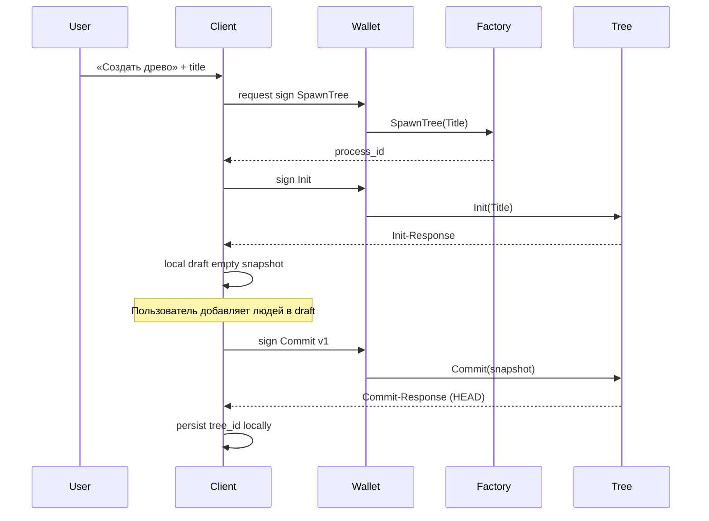

# Flow 01 — Создать древо

## Цель

Пользователь получает автономный Tree Process и genesis-commit.

## Участники

Client UI, Wallet (Wander/ArConnect), Factory Process, Tree Process, HyperBEAM.

## Шаги

## Локальный MVP (Phase 1)

Без Factory/Wallet: `createTree(title)` в `treeEngine.ts` создаёт local store.  
Genesis происходит при первом `commitDraft`.

## Ошибки

| Ситуация | Поведение |
|----------|-----------|
| Пользователь отклонил подпись | Abort, без process |
| Init уже был | `AlreadyInitialized` — продолжить с Info |
| Потеря process_id | восстановить через ListTrees / локальный backup |

## Артефакты после успеха

- `tree_id` (= process id)
- `head` commit v1
- local pointer в client storage
