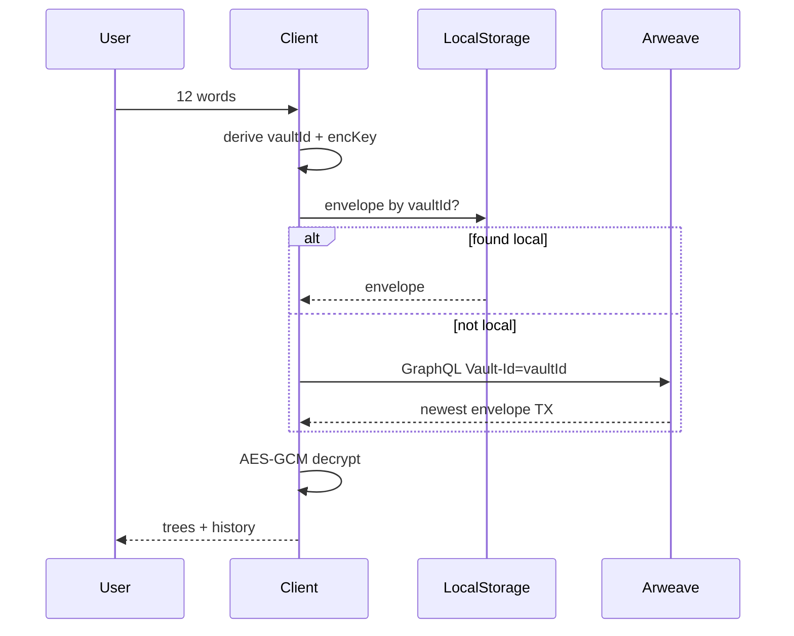

# Flow 07 — Доступ по 12 словам

## Цель

Открыть вечный сейф семейных деревьев **с любого устройства**, зная только BIP-39 фразу.

## Создание

1. UI генерирует 12 слов
2. Пользователь записывает offline
3. Подтверждает повторным вводом
4. Клиент: `deriveKeys` → `vaultId` + `encKey`
5. Создаётся пустой `VaultV1`, локально сохраняется **зашифрованный** envelope

## Восстановление (любая точка мира)

## Публикация в вечность

1. Пользователь нажимает «В вечность»
2. Из seed детерминированно строится Arweave JWK (один раз)
3. Envelope публикуется с тегами `App-Name=SEJIRE`, `Vault-Id=…`
4. Нужен небольшой баланс AR (разовый endowment)

## Экспорт без AR

«Экспорт» скачивает envelope JSON. На другом устройстве: 12 слов + файл.

Спека: [`docs/security/SEED_ACCESS.md`](../security/SEED_ACCESS.md)
