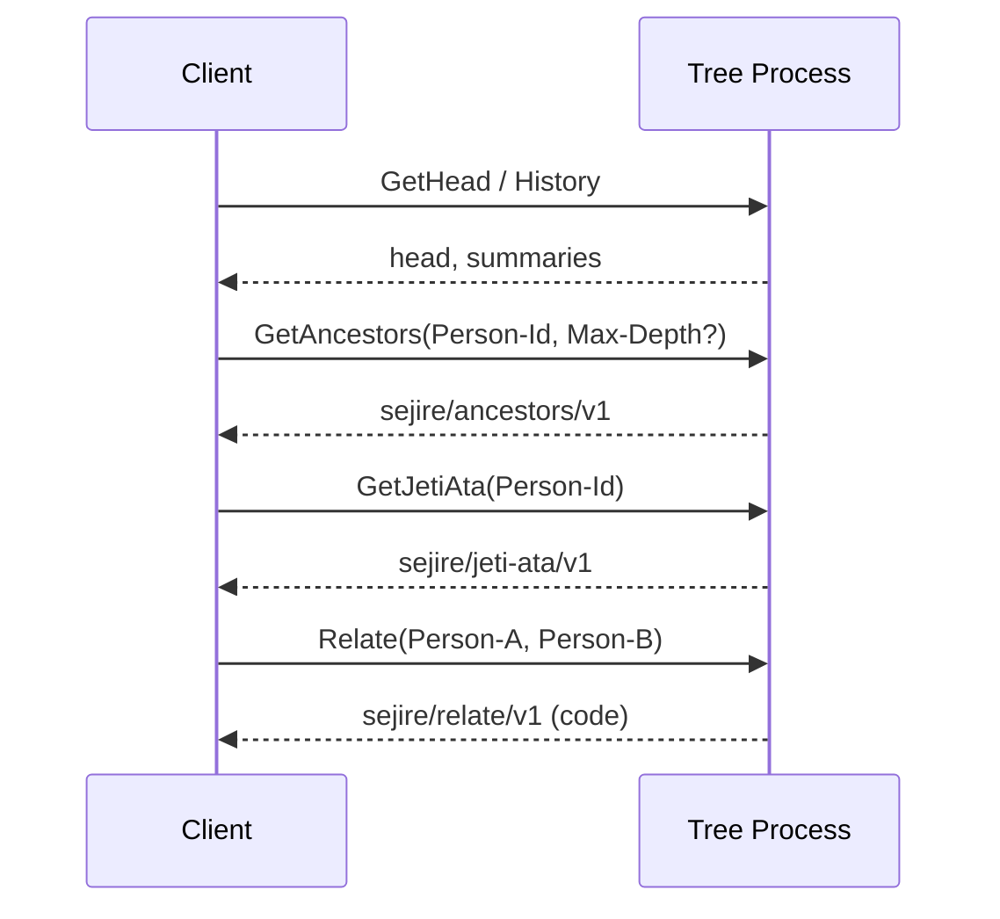

# Flow 11 — Kinship query (AO Tree Process)

## Цель

Прочитать родство из автономного Tree Process: предки, жеті ата, отношение двух людей. Без мутации, без кассира.

## Участники

Client, Tree Process. Wallet нужен только если процесс live и dry-run недоступен; чтение v1 публичное.

## Шаги

Опциональный tag `Commit-Id` выбирает исторический snapshot вместо HEAD.

## Локальный режим

`SejireAoClient({ mode: "local" })` + `LocalTreeProcess` — тот же каталог сообщений, без aos.  
Тест: `cd apps/web && npm run test:protocol`.

## Ошибки

| Ситуация | Error-Code |
|----------|------------|
| Нет ни одного Commit | `EmptyTree` |
| Нет Person-Id / пары A+B | `BadPersonId` |
| Человек или commit не найден | `NotFound` |

## Артефакты

- `code` родства (не локализованная строка)
- линия жеті ата для PDF / экрана
- предки с distance для схемы
